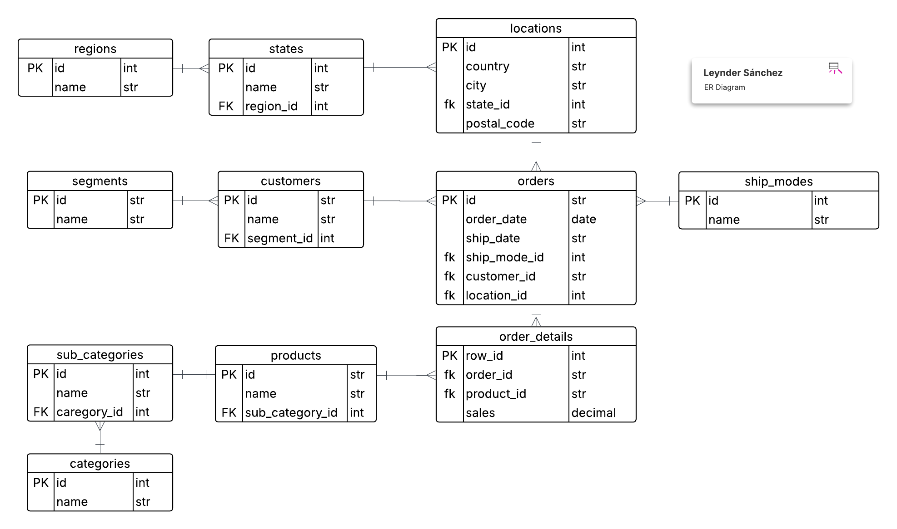

# 📊 Dashboard de Ventas

Este proyecto es una aplicación web full stack que implementa un cuadro de mando (dashboard) para analizar ventas de una tienda, basado en el dataset proporcionado. Incluye filtros dinámicos, indicadores, tablas y gráficos que responden a los filtros seleccionados por el usuario.

Desarrollado con **Django** en el backend (usando consultas SQL puras, sin ORM), **PostgreSQL** como base de datos, y **React + Vite + TypeScript** en el frontend. Todo desplegado con **Docker Compose** para facilitar la ejecución.

El frontend utiliza HTML, CSS y JavaScript (a través de React), con TypeScript como una extensión de JS que añade tipado estático para mayor robustez y detección temprana de errores. TypeScript se compila directamente a JavaScript puro, manteniendo la compatibilidad total con los requerimientos del proyecto (HTML/CSS/JS o framework de preferencia), pero ofreciendo ventajas como código más mantenible y escalable sin complicaciones adicionales.

---

## 📁 Estructura del proyecto

```
superstore-sales-ds/
├── backend/          # Django (API, modelos, vistas, filtros y repositorios SQL)
│   ├── dashboard/    # App principal con views, models, filters y repositories
│   └── ...
├── frontend/         # React + Vite + TypeScript
├── .env.example      # Ejemplo de variables de entorno
├── docker-compose.yml
├── er_diagram/       # Diagrama ER de la base de datos
└── README.md
```

---

## 🚀 Requisitos

- **Docker** y **Docker Compose** (para despliegue completo)
- **Node.js 20+** (para desarrollo local del frontend sin Docker)
- **Python 3.12+** y **PostgreSQL** (para desarrollo local del backend sin Docker)

---

## ⚙️ Configuración rápida

### 1. Clonar el repositorio

```bash
git clone <repo-url>
cd superstore-sale-ds
```

### 2. Renombrar `.env.example` a `.env`

Actualiza las variables de entorno según sea necesario (e.g., credenciales de PostgreSQL).

### 3. Levantar los contenedores

```bash
docker-compose up
```

Esto inicia el backend (Django en puerto 8000), frontend (React en puerto 5173) y la base de datos (PostgreSQL).

**Nota**: Se debe esperar a que el backend termine de ejecutar los scripts de creación de bd y población. Una vez se levante la app funcionará sin problemas

### 4. Acceder a la app

| Servicio    | URL                                          |
| ----------- | -------------------------------------------- |
| Frontend    | http://localhost:5173                        |
| Backend API | http://localhost:8000/ap1/v1/dashboard/data/ |

**Nota**: La comunicación entre frontend y backend se maneja a través de la red de Docker Compose.

### 5. Detener y limpiar

Para detener los contenedores y limpiar volúmenes (resetear la base de datos):

```bash
docker-compose down -v
```

---

## 🛠️ Funcionalidades

### Filtros

- **Rango de fechas**: Selección de fechas inicial y final (basado en el rango de fechas órdenes en la BD).
- **Categoría y Subcategoría**: Filtro jerárquico; al seleccionar categorías, se cargan solo las subcategorías correspondientes.
- **Estado y Ciudad**: Filtro jerárquico; al seleccionar estados, se cargan solo las ciudades correspondientes.
- Todos los componentes del dashboard (indicadores, tablas, gráficos) se actualizan dinámicamente con los filtros aplicados.

### Indicadores

- **Total Ventas**: Muestra el monto total de ventas filtrado.
- **Ventas por Segmento**: Desglose de ventas por segmentos de clientes (e.g., Consumer, Corporate, Home Office).

### Tablas

- **Top 10 Clientes por Ventas**: Incluye nombre del cliente, segmento, ciudad y estado.
- **Top 20 Productos más Vendidos**: Incluye ID del producto, categoría, subcategoría y nombre del producto.

### Gráficos

- **Línea de Tiempo (Fecha vs Ventas)**: Gráfico de líneas mostrando ventas mensuales a lo largo del tiempo.
- **Ventas por Categoría**: Gráfico de barras o pastel representando el desglose por categorías.

El diseño es responsive, adaptándose a dispositivos móviles y desktops mediante principios de Responsive Design (usando TailwindCSS en el frontend).

---

## 🧩 Decisiones técnicas y supuestos

### Backend

- **Framework**: Django, configurado como servidor API con arquitectura cliente-servidor.
- **Base de Datos**: PostgreSQL para almacenar el dataset. Se modeló la BD con un diagrama ER (ver sección abajo). Datos cargados desde el CSV proporcionado.
- **Consultas**: Todas las queries se lanzan mediante SQL puro (usando `connection.cursor()`), sin ORM de Django, como se requiere.
- **Filtros Dinámicos**: Construidos en `filters_builder.py` para generar joins y where clauses condicionales, optimizando queries.
- **Endpoints**: API REST con endpoints como `/dashboard/data/` para datos agregados y `/filters/init/` para inicializar filtros.

### Frontend

- **Stack**: React + Vite para un desarrollo rápido y optimizado, con TypeScript para tipado seguro (compila a JS estándar).
- **Librerías**: Recharts para gráficos y TailwindCSS para estilos responsive.
- **Interfaz**: Componentes modulares para filtros (selects jerárquicos), indicadores (cards), tablas (paginadas) y gráficos (interactivos).

### Despliegue

- **Docker Compose**: Incluye contenedores para backend, frontend y DB, con volúmenes para persistencia.
- **Modelo Entidad Relación**: Se modeló la BD para optimizar relaciones (PLUS). El diagrama está en `./er_diagram/db_data_science.png`.



### Supuestos

- El dataset se carga inicialmente en la BD (script de migración o manual).
- No se implementaron filtros opcionales adicionales para enfocarse en los requeridos.
- Persistencia en PostgreSQL para queries eficientes.
- Estilos limpios y funcionales, priorizando usabilidad y responsive design.

---

## 📸 Capturas / GIF

### GIF de demostración


_Flujo completo: aplicar filtros, ver actualizaciones en indicadores, tablas y gráficos._

¡Gracias por revisar mi solución! Espero que cumpla con las expectativas. 🚀
